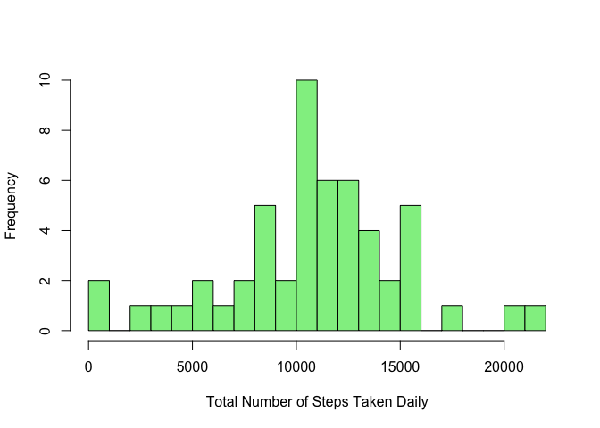
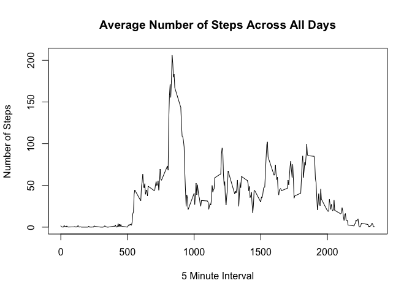
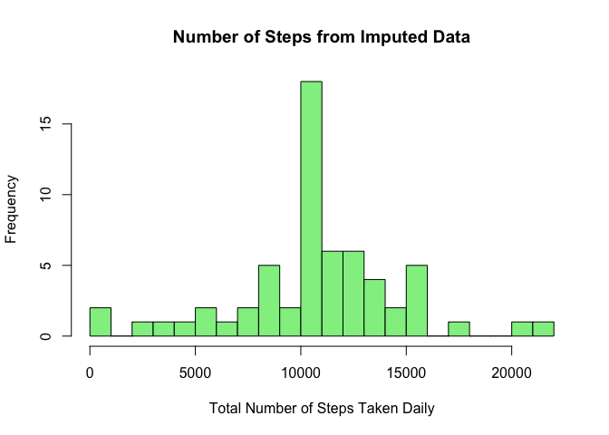
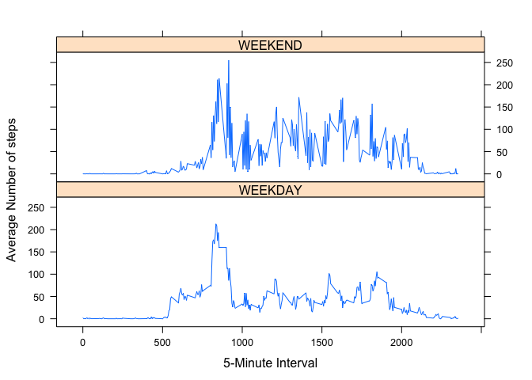

# Reproducible Research: Peer Assessment 1

```r
library(data.table, warn.conflicts=FALSE)
library(plyr, warn.conflicts=FALSE)
library(dplyr, warn.conflicts=FALSE)
library(lattice)
```

## Loading and preprocessing the data

```r
#if the zip file is not present, download, unzip and load to the activityDF data frame
if (!file.exists("activity.zip")) {
  download.file(url="http://d396qusza40orc.cloudfront.net/repdata%2Fdata%2Factivity.zip", 
                destfile="activity.zip")
  unzip("activity.zip", junkpaths=TRUE, overwrite=TRUE)
  activityDF<-fread("activity.csv")
}
#if the activityDF data frame does not exist, read the activity file into the data frame
if(!exists("activityDF")) {
  activityDF<-fread("activity.csv")
}
```

## What is mean total number of steps taken per day?
1. Make a histogram of the total number of steps taken each day.

```r
stepsByDay<-activityDF %>% filter(complete.cases(activityDF)) %>%
                           ddply(.(date), summarize, steps=sum(steps))
```


```r
hist(stepsByDay$steps, 
     main=" ",
     breaks=20,
     col="lightgreen",
     xlab="Total Number of Steps Taken Daily")
```

 
2. Calculate and report the mean and median total steps taken per day. 
a) Mean Steps Per Day

```r
meanSteps<-mean(stepsByDay$steps)
meanSteps
```

```
## [1] 10766.19
```
b) Median Steps Per Day

```r
medianSteps<-median(stepsByDay$steps)
medianSteps
```

```
## [1] 10765
```

## What is the average daily activity pattern?
1. Make a time series plot (i.e. type = "l") of the 5-minute interval (x-axis) 
   and the average number of steps taken, averaged across all days (y-axis).

```r
stepsByInterval<-activityDF %>% filter(complete.cases(activityDF)) %>%
                           ddply(.(interval), summarize, avgSteps=mean(steps))
```


```r
plot(stepsByInterval$interval, stepsByInterval$avgSteps, 
     type="l",
     xlab="5 Minute Interval",
     ylab="Number of Steps",
     main="Average Number of Steps Across All Days")
```

 
2. Which 5-minute interval, on average across all the days in the dataset, 
   contains the maximum number of steps?

```r
mInterval<-stepsByInterval %>% arrange(desc(avgSteps)) %>% head(1)
mInterval
```

```
##   interval avgSteps
## 1      835 206.1698
```
**The 835 interval has the highest average steps at 206.1698113.**

## Imputing missing values
1.Calculate and report the total number of missing values in the dataset (i.e. the total number of rows with NAs)

```r
nbrIncomplete<-nrow(activityDF) - nrow(filter(activityDF,complete.cases(activityDF)))
nbrIncomplete
```

```
## [1] 2304
```
**The number of incomplete records is 2304. **

2. Devise a strategy for filling in all of the missing values in the dataset.   
   I've found that all of the incomplete cases are due to missing values in the steps column.  
   Therefore, I've chosen to replace the NAs in steps wiht the mean for the interval across all days.   
    
    ```r
        #Are there missing days? 
        dayDiff <- ceiling(max(as.POSIXct(activityDF$date)) - min(as.POSIXct(activityDF$date)))
        dayCount <- (apply(activityDF, 2, function(x)length(unique(x))))[2]
        dayDiff - dayCount
    ```
    
    ```
    ## Time difference of 0 days
    ```
    
    ```r
        #Are there days with missing intervals? 
        intervalByDate <- activityDF %>% ddply(.(date), summarize, intervals=length(interval))
        intervalCount <- (apply(activityDF, 2, function(x)length(unique(x))))[3]
        intervalByDate %>% filter(intervals != intervalCount)
    ```
    
    ```
    ## [1] date      intervals
    ## <0 rows> (or 0-length row.names)
    ```
    
    ```r
        #Are all of the incomplete cases due to NA values in the steps column? 
        nrow(filter(activityDF, is.na(steps)))
    ```
    
    ```
    ## [1] 2304
    ```
    
    ```r
        nbrNAsteps<-nrow(filter(activityDF, is.na(steps)))
        nbrIncomplete - nbrNAsteps
    ```
    
    ```
    ## [1] 0
    ```

3. Create a new dataset that is equal to the original dataset 
   but with the missing data filled in.

```r
#if steps is missing, replace with avgSteps for the interval, else keep the value in steps
#store result in a new data frame
imputedDF<-transform(activityDF, steps=ifelse(is.na(activityDF$steps), stepsByInterval$avgSteps[match(activityDF$interval, stepsByInterval$interval)], activityDF$steps))
```
4. a) Make a histogram of the total number of steps taken each day 

```r
impStepsByDay<-imputedDF %>% ddply(.(date), summarize, steps=sum(steps))
```
    

```r
hist(impStepsByDay$steps, 
    main="Number of Steps from Imputed Data",
    breaks=20,
    col="lightgreen",
    xlab="Total Number of Steps Taken Daily")
```

 
   
   b) Calculate and report the mean total number of steps taken per day.  

```r
impMeanSteps<-mean(impStepsByDay$steps)
impMeanSteps
```

```
## [1] 10766.19
```
   c) Calculate and report the median total number of steps taken per day.  

```r
impMedianSteps<-median(impStepsByDay$steps)
impMedianSteps
```

```
## [1] 10766.19
```
   
   b) Do these values differ from the estimates from the first part of the assignment? 
   What is the impact of imputing missing data on the estimates 
   of the total daily number of steps?
   

```r
    meanDiff<-meanSteps - impMeanSteps
    medianDiff<-medianSteps - impMedianSteps
```
   
   **The mean decreased by 0 in the imputed data set.**  
   **The median decreased by -1.1886792 in the imputed data set.**

   
## Are there differences in activity patterns between weekdays and weekends?

```r
#add a column indicating weekend or weekday
imputedDF$weekend<-ifelse(as.POSIXlt(imputedDF$date)$wday == c(0,6), "WEEKEND",  "WEEKDAY")
#calculate total steps for each 5-minute interval over weekend/weekday
stepsByWeekend<-ddply(imputedDF, .(interval,weekend), summarize, steps=sum(steps))
```

```r
xyplot(
    type="l",
    data=stepsByWeekend,
    steps ~ interval | weekend,
    xlab="5-Minute Interval",
    ylab="Number of steps",
    layout=c(1,2)
)
```

 
