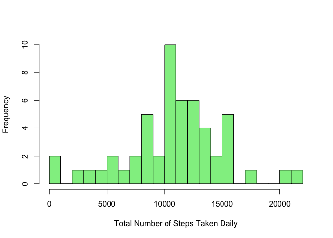
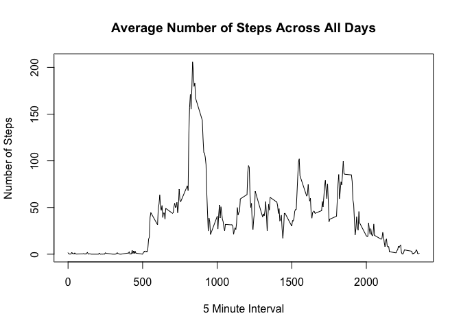

# Reproducible Research: Peer Assessment 1


## Loading and preprocessing the data
Download, unzip and read the activity file into the activityDF data frame.

```r
if (!file.exists("activity.zip")) {
  download.file(url="http://d396qusza40orc.cloudfront.net/repdata%2Fdata%2Factivity.zip", 
                destfile="activity.zip")
  unzip("activity.zip", junkpaths=TRUE, overwrite=TRUE)
  activityDF<-fread("activity.csv")
}
if(!exists("activityDF")) {
  activityDF<-fread("activity.csv")
}
```

## What is mean total number of steps taken per day?

Filter out incomplete observations and sum steps by day.


```r
stepsByDay<-activityDF %>% filter(complete.cases(activityDF)) %>%
                           ddply(.(date), summarize, steps=sum(steps))
```


Make a histogram of the total steps per day.

```r
hist(stepsByDay$steps, 
     main=" ",
     breaks=20,
     col="lightgreen",
     xlab="Total Number of Steps Taken Daily")
```

 


Calculate and report the mean and median steps per day. 

```r
meanSteps<-round(mean(stepsByDay$steps))
medianSteps<-round(median(stepsByDay$steps))
```

The mean steps per day is 1.0766\times 10^{4} and the median is 1.0765\times 10^{4}.

## What is the average daily activity pattern?
Filter out incomplete observations and average steps by interval

```r
stepsByInterval<-activityDF %>% filter(complete.cases(activityDF)) %>%
                           ddply(.(interval), summarize, avgSteps=mean(steps))
```
Make a time series plot of the 5-minute interval and the average number of steps taken, averaged across all days.

```r
plot(stepsByInterval$interval, stepsByInterval$avgSteps, 
     type="l",
     xlab="5 Minute Interval",
     ylab="Number of Steps",
     main="Average Number of Steps Across All Days")
```

 

Which 5-minute interval, on average across all the days in the dataset, contains the maximum number of steps?

```r
mInterval<-stepsByInterval %>% arrange(desc(avgSteps)) %>% head(1)
```
The 835 interval has the highest average steps at 206.1698113.

## Imputing missing values


## Are there differences in activity patterns between weekdays and weekends?
