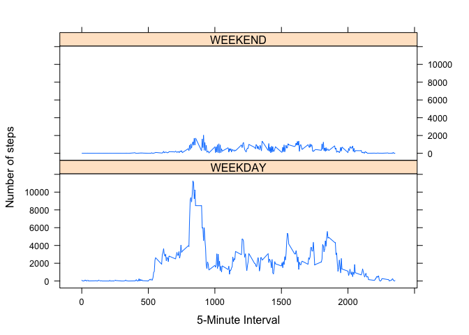

# Reproducible Research: Peer Assessment 1


## Loading and preprocessing the data

```r
if (!file.exists("activity.zip")) {
  download.file(url="http://d396qusza40orc.cloudfront.net/repdata%2Fdata%2Factivity.zip", 
                destfile="activity.zip")
  unzip("activity.zip", junkpaths=TRUE, overwrite=TRUE)
  activityDF<-fread("activity.csv")
}
if(!exists("activityDF")) {
  activityDF<-fread("activity.csv")
}
```

## What is mean total number of steps taken per day?

```r
stepsByDay<-activityDF %>% filter(complete.cases(activityDF)) %>%
                           ddply(.(date), summarize, steps=sum(steps))
```


```r
hist(stepsByDay$steps, 
     main=" ",
     breaks=20,
     col="lightgreen",
     xlab="Total Number of Steps Taken Daily")
```

 


```r
meanSteps<-mean(stepsByDay$steps)
medianSteps<-median(stepsByDay$steps)
```

**The mean steps per day is 1.0766\times 10^{4} and the median is 1.0765\times 10^{4}. **  


## What is the average daily activity pattern?

```r
stepsByInterval<-activityDF %>% filter(complete.cases(activityDF)) %>%
                           ddply(.(interval), summarize, avgSteps=mean(steps))
```


```r
plot(stepsByInterval$interval, stepsByInterval$avgSteps, 
     type="l",
     xlab="5 Minute Interval",
     ylab="Number of Steps",
     main="Average Number of Steps Across All Days")
```

 


```r
mInterval<-stepsByInterval %>% arrange(desc(avgSteps)) %>% head(1)
```
**The 835 interval has the highest average steps at 206.1698113.**

## Imputing missing values
1.Calculate and report the total number of missing values in the dataset (i.e. the total number of rows with NAs)

```r
nbrIncomplete<-nrow(activityDF) - nrow(filter(activityDF,complete.cases(activityDF)))
nbrIncomplete
```

```
## [1] 2304
```
**The number of incomplete records is 2304. **

2. Devise a strategy for filling in all of the missing values in the dataset. 
    a) Are there missing days? 
    
    ```r
        dayDiff <- ceiling(max(as.POSIXct(activityDF$date)) - min(as.POSIXct(activityDF$date)))
        dayCount <- (apply(activityDF, 2, function(x)length(unique(x))))[2]
        dayDiff - dayCount
    ```
    
    ```
    ## Time difference of 0 days
    ```
       *There are no missing days.*
    b) Are there days with missing intervals?
    
    ```r
        intervalByDate <- activityDF %>% ddply(.(date), summarize, intervals=length(interval))
        intervalCount <- (apply(activityDF, 2, function(x)length(unique(x))))[3]
        intervalByDate %>% filter(intervals != intervalCount)
    ```
    
    ```
    ## [1] date      intervals
    ## <0 rows> (or 0-length row.names)
    ```
        *There are no missing intervals.*
    c) Are all of the incomplete cases due to NA values in the steps column? 
    
    ```r
        nrow(filter(activityDF, is.na(steps)))
    ```
    
    ```
    ## [1] 2304
    ```
    
    ```r
        nbrNAsteps<-nrow(filter(activityDF, is.na(steps)))
        nbrIncomplete - nbrNAsteps
    ```
    
    ```
    ## [1] 0
    ```
        *All incompletes are NA steps.*
    d) Based on the info from a,b, and c, I am choosing to replace NAs in steps with mean for the
       interval. 
3. Create a new dataset that is equal to the original dataset 
   but with the missing data filled in.
    
    ```r
        imputedDF<-transform(activityDF, steps=ifelse(is.na(activityDF$steps), stepsByInterval$avgSteps[match(activityDF$interval, stepsByInterval$interval)], activityDF$steps))
      #      imputedDF<-transform(imputedDF, steps=ifelse(date="2012-10-01", 0, steps))
    ```
4. a) Make a histogram of the total number of steps taken each day 
   and Calculate and report the mean and median total number of steps taken per day. 
   

```r
    impStepsByDay<-imputedDF %>% ddply(.(date), summarize, steps=sum(steps))
    impMeanSteps<-mean(impStepsByDay$steps)
    impMedianSteps<-median(impStepsByDay$steps)
```
    

```r
    hist(impStepsByDay$steps, 
        main="Number of Steps from Imputed Data",
        breaks=20,
        col="lightgreen",
        xlab="Total Number of Steps Taken Daily")
```

 

   **With imputed data, the mean steps per day is 1.0766189\times 10^{4}**  
   **and the median is 1.0766189\times 10^{4}.**
   
   b) Do these values differ from the estimates from the first part of the assignment? 
   What is the impact of imputing missing data on the estimates 
   of the total daily number of steps?
   

```r
    meanDiff<-meanSteps - impMeanSteps
    medianDiff<-medianSteps - impMedianSteps
```
   
   **The mean decreased by 0 in the imputed data set.**  
   **The median decreased by -1.1886792 in the imputed data set.**

   
## Are there differences in activity patterns between weekdays and weekends?

```r
imputedDF$weekend<-ifelse(as.POSIXlt(imputedDF$date)$wday == c(0,6), "WEEKEND",  "WEEKDAY")
stepsByWeekend<-ddply(imputedDF, .(interval,weekend), summarize, steps=sum(steps))
avgStepsByWeekend<-ddply(imputedDF, .(interval,weekend), summarize, avgSteps=mean(steps))
```

```r
qplot(interval, steps, data=stepsByWeekend, 
      group=weekend, color=weekend, geom=c("point","line"),
      xlab="5-minute Interval", ylab="Total Steps", 
      main="Comparison of Weekend and Weekday Activity")
```

 
